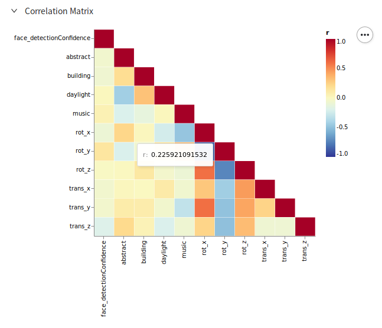

# Review

Once you have selected predictors, applied transformations, and defined your contrasts, you're ready to review the statistical model you've designed.

## Design Report

Upon reaching the `Review` tab, a report is requested from the Neuroscout server that will validate your analysis, apply transformations and pre-compute the design matrix to be fit to the fMRI data.
It may take a few minutes to receive the report.

### Design Matrix

Here you can interactively review the final design matrix that will be fit at the first-level of your analysis.
The top plot will give you an overview of the design matrix, with each column of the design matrix on the x-axis and time on the y-axis.

In the bottom plot, you can explore the predictor time courses in more detail. By clicking on the legend on the right, you can select specific predictors to plot. You may shift-click to select multiple predictors at once.

!!! Note
    For display purposes, each column is standardized prior to the creation of these plots, even if you did not request a `scale` transformation.
    This force re-scaling will not be performed when creating the actual design matrix.

### Correlation Matrix

The correlation matrix provides you can opportunity to review the covariance between your predictors.
Note that predictors that are highlight correlated with each other may result in a rank deficient design matrix which will cause model fitting to fail.

!!! Hint
    Hover over values in the plot to see the correlation r-values.

## Analysis Overview

Finally, a complete summary of your analysis is displayed in this tab. Here you can review all of the choices you've made and ensure you are happy with the analysis prior to continuing.

!!! Note
    Neuroscout stores your model design using BIDS Stats-Model, an in-development JSON standard for representing fMRI models.
    This is the true, final representation of your model, so if you are having problems, or would like to meticulously review your analysis, review this section.
